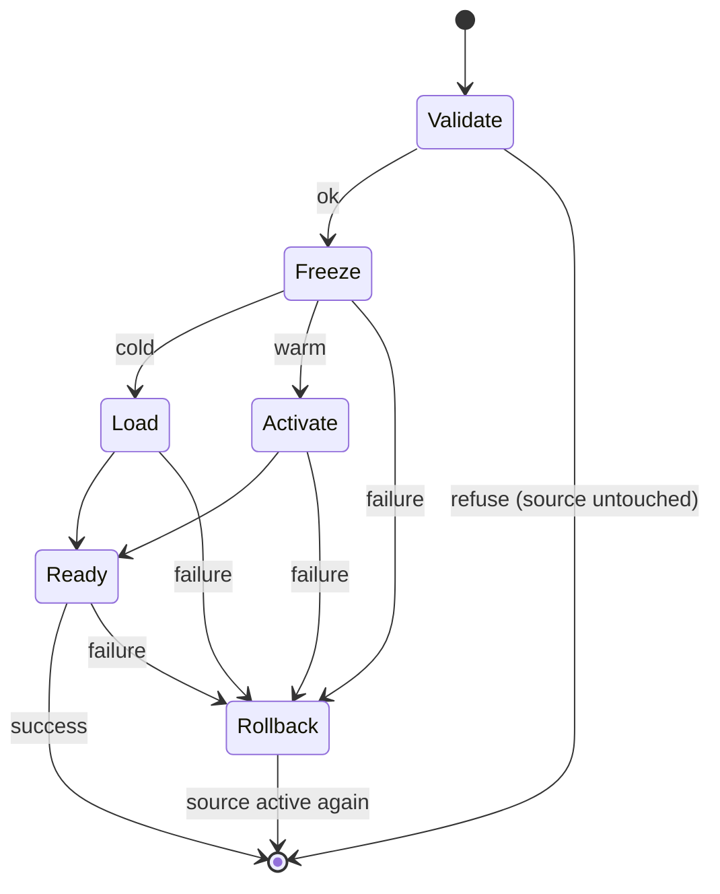

# Residency core: one active world and one frozen world

Status: design approved by the owner in conversation (2026-10-09). Implemented on branch
`residency-core` (uncommitted) and natively qualified 2026-10-09 with Ruinarch+ disabled and
enabled; decision and gate results in
`/home/deniz/ruinarch-runs/residency-core-green-4/decision.json`.

## Goal

A mod can travel between two native Ruinarch saves without reloading the one it
left. The world being left is frozen in memory: it stops ticking, drawing,
pathfinding and simulating physics, and keeps every object, job and listener. Coming
back reactivates it in well under a second instead of a full native reload
(measured: warm switches 0.21–0.50 s versus about 55 s for a Large reload).

This is the first of four sub-projects:

1. **Residency core (this spec).**
2. Deferred commit: serialize the departure save in the background (separate spec).
3. Ruinarch+ compliance: route all world-scoped state through `ModSave` (separate spec).
4. TruePlanet wiring and the tile-worlds spec amendment (separate spec).

## What exists today

- No production residency code. A throwaway prototype (`FrozenWorld`, `WorldPhysics`,
  `WorldLifetime`, `OwnedRoutines`, `PathfinderScope`) is retained in
  `/home/deniz/ruinarch-runs/native-save-deferred-residency-6/repro-source/LoadProfile/`.
- The prototype's evidence and decisions are in
  `/home/deniz/ruinarch-runs/native-save-deferred-residency-6/decision.json`. Earlier runs:
  `native-tile-residency-{proof,trace,isolated}-*`.
- `Ruinarch.ModContent` (`src/Ruinarch.ModContent/`) already owns per-save mod data:
  `ModSave.Register(id, save, load)`; `ResetAll` on `Initializer.InitializeDataBeforeWorldCreationMainThread`,
  `WriteAll(Utilities.tempZipPath)` on `DoManualSave`, `ReadAll(Utilities.tempPath)` on
  `SaveManager.DeleteSaveFilesInTempDirectory` (`ModSave.cs`). Ruinarch+ (10 features) and
  TruePlanet use it.
- The approved TruePlanet tile-worlds spec (`RuinarchMods/docs/specs/2026-10-07-trueplanet-tile-worlds-design.md`)
  currently requires a single-scene lifecycle. Sub-project 4 amends it; this spec does not.

## Scope

In scope: at most one active world and one frozen world; cold travel to a new save while
retaining the current world; warm switch back to the retained world; eviction of the
retained world when travelling to a third save; mod state swapping through `ModSave`;
transition safety and self-checks.

Out of scope: background (deferred) save; making Ruinarch+ compliant; TruePlanet or any
UI wiring; retaining more than one frozen world; simulating closed worlds; advancing a
reopened world's clock; Extra Large/Huge qualification.

## Public API

Namespace `Ruinarch.ModContent`, static class `Residency`:

```csharp
public static class Residency
{
    // Idempotent. Installs the residency patches (separate Harmony id
    // "ruinarch.modcontent.residency"). Must run before the first game scene loads,
    // i.e. from a mod's OnLoad; ModContent.Install never installs them, so players
    // whose mods do not call Enable get no residency patches at all.
    public static void Enable();

    // Travel to a native save. If savePath is the retained world, switch warm;
    // otherwise freeze the current world and cold-load savePath beside it
    // (evicting a previously retained world). Starts its own coroutine.
    public static void Travel(string savePath, Action<TravelResult> done);

    public static string RetainedSavePath { get; }   // null when nothing is retained
    public static bool IsTravelling { get; }
}

public sealed class TravelResult
{
    public bool Succeeded { get; }
    public TravelStage FailedStage { get; }          // None when Succeeded
    public string Reason { get; }                    // null when Succeeded
    public bool Warm { get; }                        // true for a retained-world switch
    public double Seconds { get; }                   // wall time of the whole transition
}

public enum TravelStage { None, Validate, Freeze, Load, Activate, Ready, Rollback }
```

The caller decides when the world being left is saved; `Travel` never saves. A world is
identified by the save it was loaded from (`SaveCurrentProgressManager.currentSaveDataPath`);
`DoManualSave` writes files without changing that path.
`Travel` rejects a call while `IsTravelling`, a call before a game has started, a call
when `Enable` ran after the active world's scene loaded, and a `savePath` equal to the
active world's save (reported as `Validate` failures).

## Components

All in `src/Ruinarch.ModContent/Residency/`, `internal` except the API above.

- **`Residency.cs`**: the API and the travel state machine (below).
- **`WorldScene.cs`**: one `PhysicsScene2D`/`PhysicsScene` per game scene created with
  `LocalPhysicsMode.Physics2D|Physics3D`, manual stepping of the active world only, and
  the Harmony transpilers that route native physics queries to the active world's
  physics scene (209 routed call sites). Tracks the active world. Loads "Game"
  additively only while `Residency` performs a cold travel; a normal load still unloads
  everything, including a retained world.
- **`WorldSuspension.cs`**: freezes a world without unloading it: disables enabled
  behaviours/cameras/lights/animators/canvases and renderers, pauses particles, audio and
  the world's tweens, takes the pathfinder lock (`AstarPath.PausePathfinding` after
  flushing graph updates and work items); colliders and rigidbodies are left untouched.
  `Verify()` proves the frozen world has not advanced; `Resume()` restores exactly what
  was suspended.
- **`RoutineOwnership.cs`**: wraps coroutines started by `Game`-scene behaviours so they
  pause with their world (including `WaitForSeconds`, `WaitForSecondsRealtime`,
  `CustomYieldInstruction` and nested routines).
- **`PathfinderScope.cs`**: restricts `AstarPath.Awake`, `GraphModifier.FindAllModifiers`
  and `RelevantGraphSurface.FindAllGraphSurfaces` discovery to the constructing scene.
- **`WorldState.cs`**: per-world ownership of process-wide state (inventory below);
  `Capture()`, `DetachForColdLoad()`, `Restore()`.
- **`ModStateSwap.cs`**: uses two new internal `ModSave` members,
  `Dictionary<string,string> CaptureAll()` (each handler's `save()`) and
  `RestoreAll(Dictionary<string,string>)` (each handler's `load(json)`), plus the existing
  `ResetAll()`. Performs the round-trip check.
- **`TransitionGuard.cs`**: subscribes to `Application.logMessageReceivedThreaded` for the
  duration of a transition (so worker-thread exceptions count), records the current stage,
  and drives rollback. The shipped game switches Unity's logger off in
  `WorldConfigManager.Awake` (on every scene load), which would hide every error, so the
  guard keeps `Debug.unityLogger.logEnabled` on for the transition (re-asserted each frame)
  and restores the previous value afterwards.

### Process-wide state each world owns (`WorldState`)

Captured when a world freezes and restored when it reactivates. Each item is backed by
prototype evidence.

| State | Treatment |
|---|---|
| Static fields of every `Assembly-CSharp` `MonoBehaviour` type whose static `Instance` is live, plus `BaseParticleEffect`, `Utilities`, `AstarPath` | reference captured/restored; scene-owned components cleared on cold load |
| `SaveManager`, `saveCurrentProgressManager`, `DatabaseManager`, `WorldSettings`, `WorldConfigManager`, `Ruinarch.InputManager`, `PlayerSkillManager` (+ each skill, its event dispatcher, passive skills, loadouts) instance fields | captured/restored (collections copied where the prototype copied them) |
| `TruePlanet.ProvinceGame` statics, when that type exists | captured/restored |
| Native `SignalHandler*._handles` registries | copied per world; on cold load, listeners owned by the frozen world are removed |
| `UnityEngine.Random.state` | captured/restored |
| A* `GridNode`, `LevelGridNode`, `TriangleMeshNode` static graph registries | **array copies** per world (fix: shared graph index 0 sent the returning world's paths into the other world's nodes and terminated its pathfinder) |
| `WorldSettings.worldSettingsData` | on cold load the loading world gets `new WorldSettingsData()` (fix: `Initializer.cs:22` randomized the frozen world's cultist thresholds) |
| `CharacterPortraitSpriteCollection._portraitAvailability` on `ExternalFileManager` collections | array copies per world (fix: the returning world carried the other world's portrait usage) |

Anything outside this inventory that a mod or the game keeps process-wide is not
isolated. The round-trip check and the qualification diff exist to catch it.

## Travel sequence



1. **Validate.** Refuse, leaving the source untouched, when: travelling already, no game
   started, `savePath` missing or equal to the active save, a `Game`-scene behaviour has
   pending `Invoke` calls, a `Game`-scene coroutine was started by name, the game is
   saving/writing to disk, or the pathfinder has queued graph updates that do not flush.
2. **Freeze.** `ModSave.CaptureAll()` for the source; `WorldSuspension` freeze;
   `WorldState.Capture()`. Cold travel to a third save then evicts the old retained
   world: make its captured state current (its own pathfinder, graph registry and
   singletons, so its `OnDestroy` code cleans up its own state), release its pathfinder
   lock, unload its scene, and make the source's state current again; its mod state is
   discarded. Then `ModSave.ResetAll()`.
3. **Load (cold).** `WorldState.DetachForColdLoad()`; native load of `savePath` as an
   additional scene through the game's own loading screen.
   **Activate (warm).** `WorldState.Restore()`; `WorldSuspension.Resume()`;
   `ModSave.RestoreAll(retained capture)`.
4. **Ready.** Loading screen hidden, `GameManager.gameHasStarted`, the A* registry's grid
   graph is the active `AstarPath`'s graph, and no error was logged on any thread during the
   transition. Warm switches then run the round-trip check: each handler's `save()` must
   equal the string it returned when that world froze. A mismatch is logged as an error
   naming the handler id; it does not roll back.
5. The previous world becomes the retained world; `done` receives the result.

### Failures

- Before Freeze: nothing changed; result reports `Validate`.
- From Freeze on: unload any partially loaded destination scene, restore the source with
  `WorldState.Restore()`, `WorldSuspension.Resume()` and `ModSave.RestoreAll(source capture)`,
  then report the failed stage. If rollback itself fails, report `Rollback` and leave the
  game paused with the error visible; never mark the destination active.

## `ModSave` contract (documentation change, no signature change)

Added to `docs/CONTENT_FRAMEWORK.md`:

- `save()` must not change any state.
- `load(null)` must clear every bit of world-scoped state the mod keeps.
- `load(json)` must restore exactly what `save()` produced.
- World-scoped state kept outside a `ModSave` handler leaks between resident worlds (and
  between games in a session).

## Error handling and logging

Every transition logs one line per stage and the final `TravelResult` through Unity's
logger (visible because the guard keeps it on). Errors on any thread during a transition
fail it. Refusals name the reason (for example the behaviour type with a pending `Invoke`).
Qualification probes must keep the logger on for the whole run, or errors after a travel
go unseen.

## Qualification

A throwaway native probe (not shipped) drives the public API in the real game with the
existing protected-run discipline: snapshot and byte-restore the 13 protected files, Steam
idle gating, evidence retained under `/home/deniz/ruinarch-runs/`, game stopped, probe removed.

Runs use the Small and TruePlanet Large fixtures, Ruinarch+ **disabled**, and must show:

1. Cold travel Small→Large retaining Small; warm Large→Small; warm Small→Large; a second
   warm round trip.
2. Exact retained-world dumps (terrain, objects, characters) before freeze vs after return.
3. Re-save right after each warm return: `mainSave.sav` and `ModData` differ from the
   departure save only in `fileName`, `timeStamp` and the differences a stock
   single-world save-twice control produces (log filler `null`/`""`, tile `nonDefaultCounter`).
4. Grid-registry check true at every stage; a real path request completes in each world;
   villager movement in both worlds; zero errors on any thread; zero
   `Unhandled exception during pathfinding` in `Player.log`.
5. Round-trip check passes for TruePlanet's handler.
6. A stock-physics native reload of a save committed after residency matches the
   resident reload (terrain, characters; objects except the known ThinWall IDs).
7. Red/green: each of the three `WorldState` fixes disabled in turn reproduces its failure.
8. Forced failures (injected by the probe through Harmony, not by production hooks): a
   missing/corrupt destination ZIP, and an exception at Freeze, Load and Activate; each
   leaves the source active and its dumps unchanged.
9. Eviction: travel to a third save unloads the retained world and leaves no frozen state.
10. Recorded, not promised: transition times, frame gaps, managed/Unity memory.

A run with Ruinarch+ **enabled** is recorded too; its round-trip violations are the input
to sub-project 3, not a failure of this one.

## Risks

- The state inventory is empirical. Untested features (combat, RFX, specific UI windows,
  quests) may keep process-wide state the inventory misses.
- Two Large worlds held about 3.8–4.7 GB of managed memory in the prototype.
- Native updates to the game can change any patched method; `tools/check-patches.sh`
  catches missing targets, not changed behaviour.
